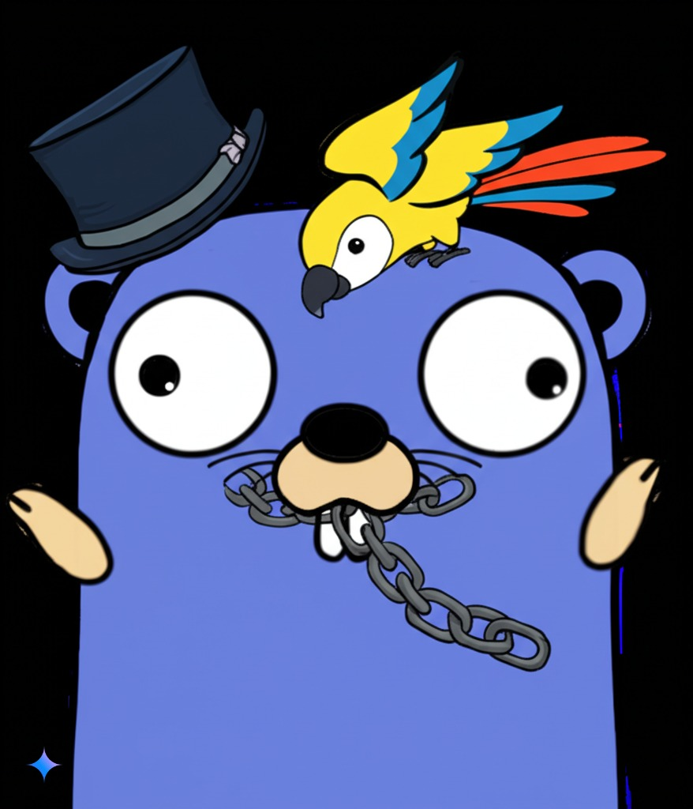

# Langchain Demos

This repository contains demos and exercises exploring [Langchain Go](https://tmc.github.io/langchaingo/docs/).

My original goal was to experiment with AI tools and understand how they work, particularly the vector database aspect. I had a few project ideas in mind and expected to spend significant time digging into documentation and coding. However, I was pleasantly surprised by how simple it was to get started—just a few lines of code! From that point, I was sold on using Langchain Go.

Langchain is a framework for building applications with LLMs. It supports various models and vector databases. The snippets and gists here are intended for future projects and knowledge sharing with colleagues.

You will need an API for most, if not all, of these demos. I skipped my Dunkin' Donuts coffee for a week, and the savings have lasted me since 2024. Your mileage may vary.

You can also sign up for an API with Google Gemini: <https://aistudio.google.com/>  
This seems to be free and quite generous.

## Vector DB Search with Langchain and ChromaDB

The first experiment was to see how easy it is to set up a vector database and push/pull data from it.

This demo is similar to the Langchain Go example and comes in two flavors:

- [Chroma demo with OpenAI](./vector-chroma/readme.md)  
- [Chroma demo with Gemini](./vector-chroma-gemini/readme.md)

## Generate from a Simple Prompt

[Simple Prompt with Gemini](./gemini-example-simple/readme.md)

This is a basic example to demonstrate how it works.

