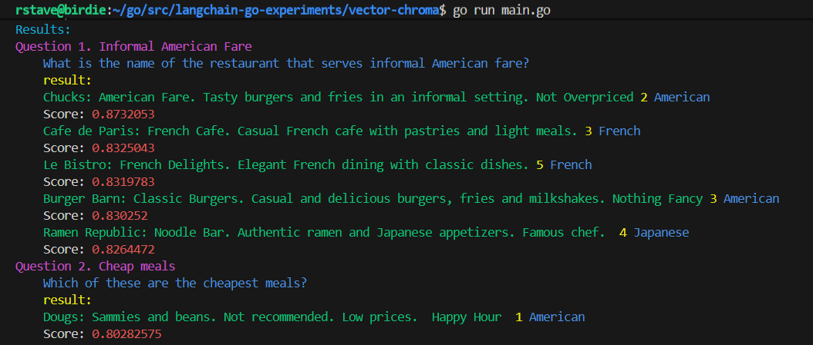

# Langchain Go Example

Example that uses LangChainGo and Chromadb to query a vector store.

This is pretty much the same example as https://github.com/tmc/langchaingo/tree/main/examples/chroma-vectorstore-example with just a few differences:

- Using godotenv for environment variables
- Different documents
- Dazzling colors

## Running

### Chromadb

You will need to have a version of Chromadb. In this case, I'm using Docker.

```bash
docker pull ghcr.io/chroma-core/chroma:0.5.0
docker run -d --name chroma -p 8989:8000 ghcr.io/chroma-core/chroma:0.5.0
```

### OpenAI

You will need an OpenAI key. Set this in the `.env` file along with the URL of Chroma. I have a collection name here too, but for this example, there is UUID. As of 3/25, embedding at the "large" is like 15 cents for a million tokens. This example is much less.

Create a `.env` file with the following content:

```bash
CHROMA_URL=http://localhost:8989
CHROMA_COLLECTION_NAME=default
OPENAI_API_KEY=xyz
```

## Results




